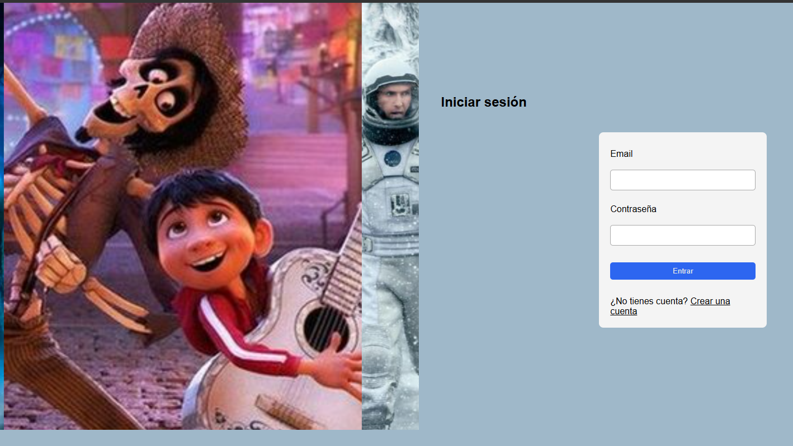
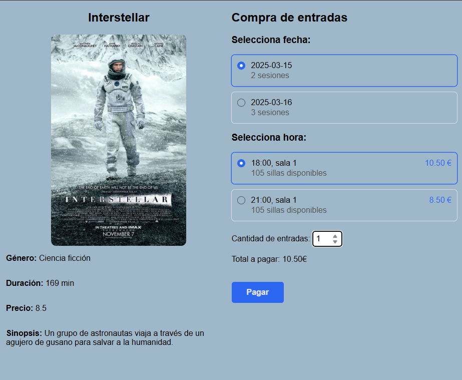
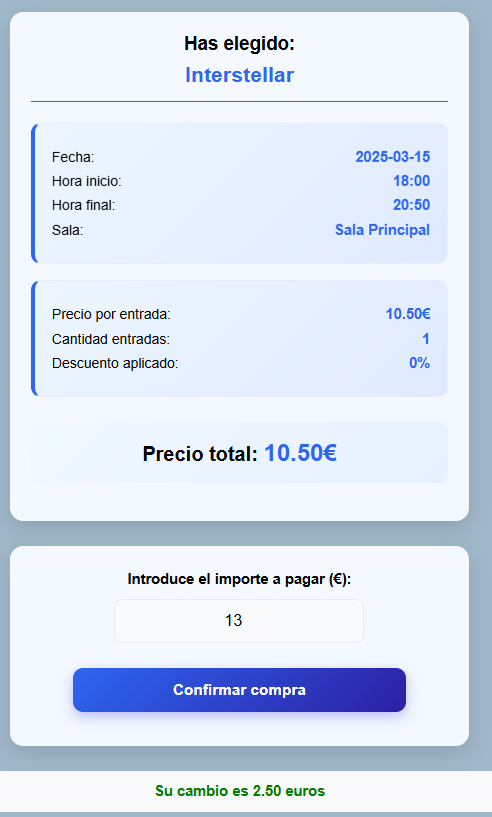
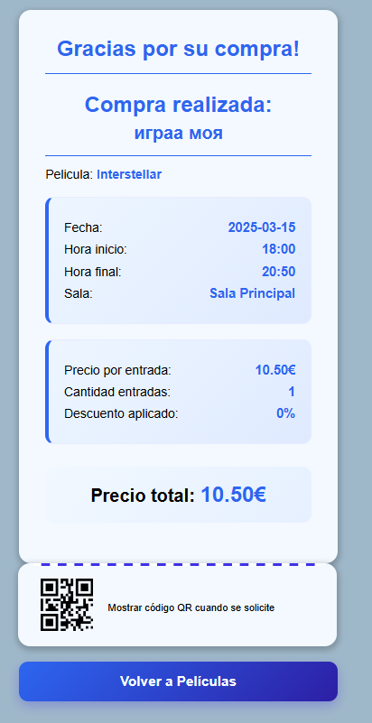

# Reto2-html

# Web Cartelera Cine

## Опис проєкту

**Web Cartelera Cine** — це сучасний вебсайт для вибору фільмів, оформлення покупки та перегляду чека. Проєкт створений у приємному темному стилі, щоб передати атмосферу кінотеатру та зробити користування сайтом зручним і зрозумілим.

Користувач може:

- зареєструватися або увійти в систему;
- переглянути список фільмів;
- обрати сеанс і місця;
- оформити оплату;
- отримати чек покупки.

## Основні сторінки

- **index.html** — стартова сторінка та форма входу/реєстрації.
- **cartelera.html** — сторінка з добіркою фільмів.
- **pelicula.html** — детальна інформація про фільм.
- **compra.html** — оформлення покупки.
- **factura.html** — сторінка з чеком.
- **nuevoCliente.html** — реєстрація нового клієнта.

## Головні переваги

- інтуїтивний інтерфейс;
- стильне оформлення в кінотематиці;
- логічний шлях користувача від вибору фільму до оплати;
- адаптована структура для подальшого розвитку проєкту.

## Скриншоти

### Логін



### Список фільмів


### Вибір сеансу



### Оплата



### Чек покупки



## Структура проєкту

```text
Web-cartelera-cine/
├── index.html
├── cartelera.html
├── compra.html
├── factura.html
├── nuevoCliente.html
├── pelicula.html
├── db.php
├── css/
├── js/
├── img/
├── vid/
└── FotoREADME/
```

## Технології

- HTML5
- CSS3
- JavaScript
- PHP

## Примітка

Усі зображення для цього README взяті з папки **FotoREADME** та використовуються для демонстрації основних екранів сайту.
